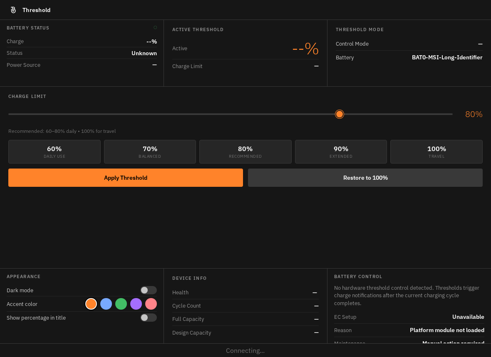
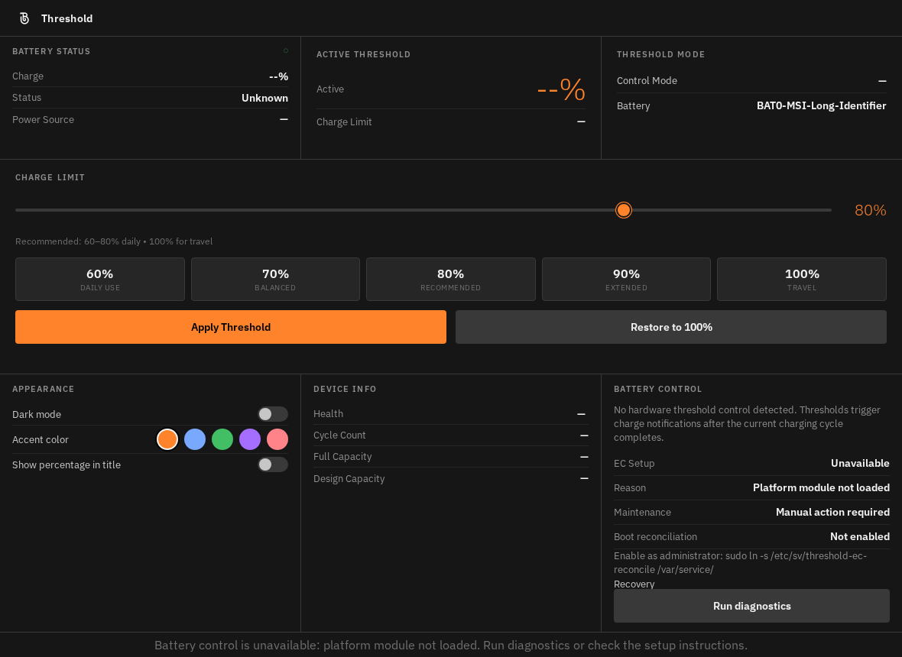
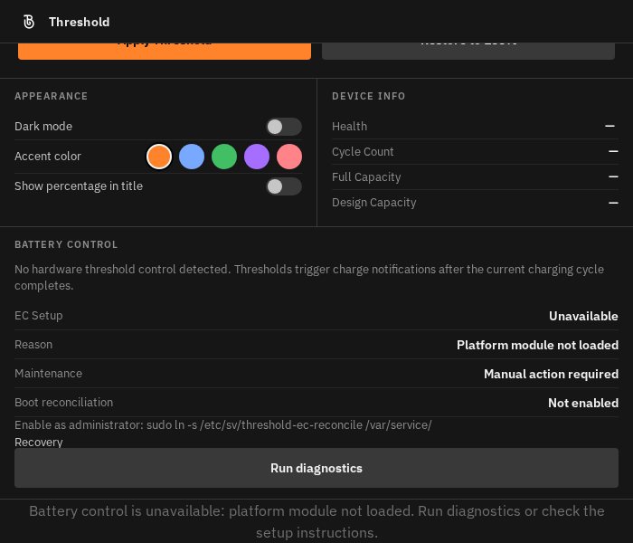

# Adaptive dashboard layout evidence

This probe uses Chromium to render the committed web bundle. The expanded state is synthetic: it exposes every optional EC row, a recovery action, a long command, and a long status bar message. It is not a reproduction of the user's exact device state.

Before the change, the 1180×860 render gave Battery Control a fixed 180px row although its content needed 337px. Seven text ranges were cut by the card's hidden overflow. At 960×700, the same seven ranges were clipped; at 700×600, page overflow also hid the last row and status bar. The Device Info element also lacked the ID targeted by its CSS rules.

After the change, card height follows content. The page scrolls when the available height is short, and cards stack at widths of 900px and 600px. The 1180×860 expanded state fits without scrolling. The 700×600 bottom view shows recovery action and status bar reachable by scrolling.

After `npm ci`, install the browser with `npx playwright-core install chromium-headless-shell`, build with `npm run build`, then run `npm run test:layout`. The test checks actual rendered text and control bounds, card overlap, horizontal overflow, and scroll reachability. Results from the production bundle:

| State and viewport | Content height / viewport height | Battery Control height | Result |
| --- | ---: | ---: | --- |
| Ordinary, 1180×860 | 812 / 812px | 180px | Pass |
| Expanded, 1180×860 | 812 / 812px | 337px | Pass |
| Expanded, 960×700 | 793 / 652px | 337px | Pass |
| Expanded, 900×700 | 1008 / 652px | 283px | Pass |
| Expanded, 700×600 | 1042 / 552px | 301px | Pass |
| Expanded, 600×600 | 1323 / 552px | 301px | Pass |
| Expanded, 960×500 | 793 / 452px | 337px | Pass |
| Expanded, 800×560 at 125% root text | 1300 / 512px | 376px | Pass |
| Expanded, 700×600 at 150% root text | 1586 / 552px | 478px | Pass |
| Expanded, 500×700 | 1323 / 652px | 301px | Pass |
| Expanded, 480×400 | 1341 / 352px | 319px | Pass |

The layout test passed with no text outside a card, overlapping cards, or horizontal overflow in these states. Native WebKitGTK and live DMS/niri checks remain part of the downstream desktop integration ticket.
